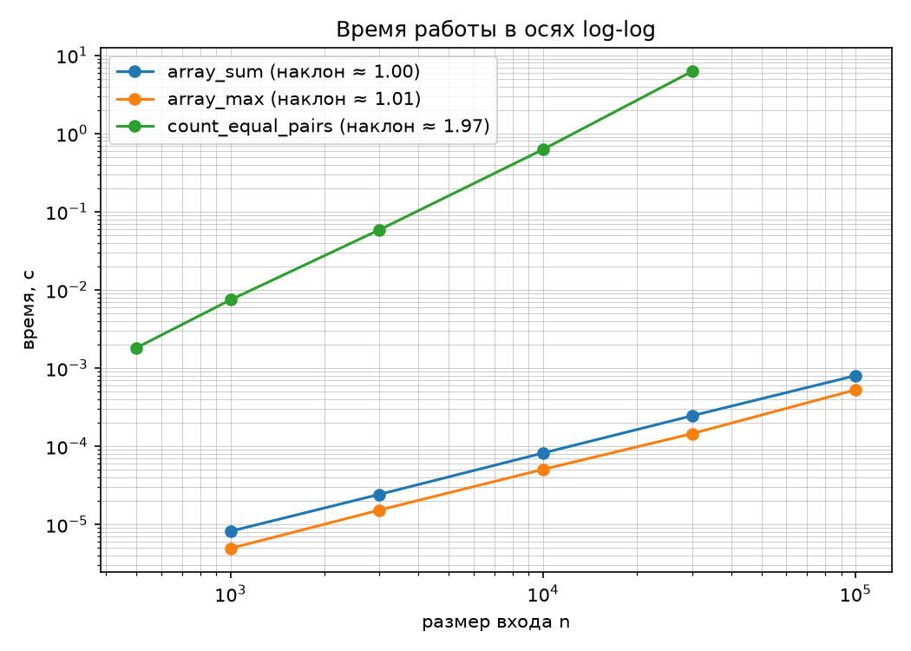
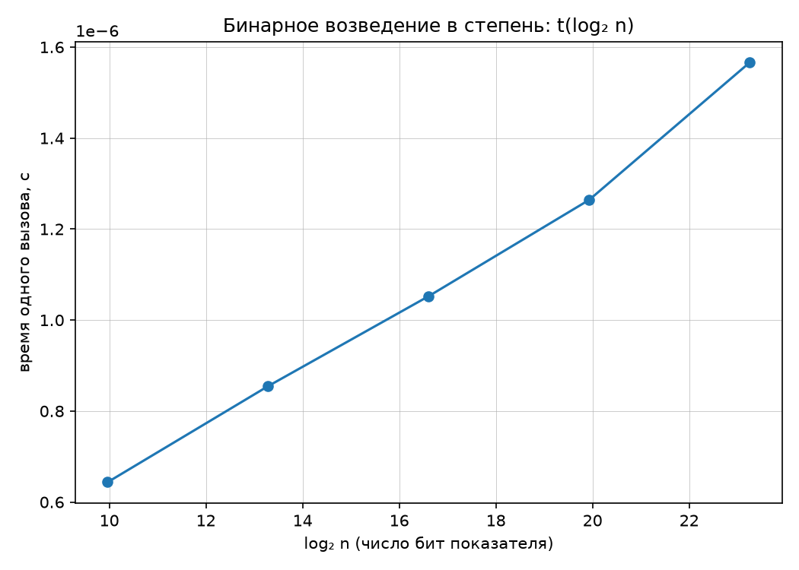

# Лабораторная работа 1 «Анализ временной сложности элементарных алгоритмов».

## Цель работы

Научиться определять временную сложность алгоритма аналитически и подтверждать оценку экспериментально.

---

# Задание

## 1. Сгенерировать данные своего варианта: `python scripts/generate_data.py --variant N --only arrays` (пять размеров с геометрическим шагом, 10³…10⁵, четыре типа массивов). Данные детерминированы: seed = 30 + N.

**Вариант:** 4, seed: 34

Данные были сгенерированы командой:
`python3 scripts/generate_data.py --variant 4 --only arrays`

---

## 2. Реализовать четыре элементарных алгоритма: (а) сумма элементов массива; (б) поиск максимума; (в) подсчёт пар равных элементов (двойной цикл); (г) бинарное возведение в степень (с поддержкой вычислений по модулю).

## 3. Для каждого алгоритма **аналитически** вывести асимптотическую оценку времени (худший случай) и записать её в отчёте с обоснованием.

### 1. Сумма элементов массива

Алгоритм последовательно проходит по всем элементам массива и накапливает их сумму.

```python
def array_sum(a: list[int]) -> int:
    total = 0
    for x in a:
        total += x
    return total
```

Если размер массива равен `n`, цикл выполняется `n` раз.

На каждой итерации выполняется постоянное количество операций: чтение элемента, сложение и присваивание, поэтому: `T(n) = Θ(n)`

Следовательно, итоговая сложность: $O(n)$.

### 2. Поиск максимального элемента

Алгоритм сохраняет первый элемент как текущий максимум и последовательно сравнивает с ним остальные элементы.

```python
def array_max(a: list[int]) -> int:
    if not a:
        raise ValueError("Массив не должен быть пустым")

    max_val = a[0]

    for x in a[1:]:
        if x > max_val:
            max_val = x

    return max_val
```

Для массива из `n` элементов выполняется `n - 1` сравнений, поэтому: `T(n) = Θ(n)`. Цикл нельзя остановить раньше: чтобы убедиться, что среди оставшихся элементов нет большего, нужно проверить их все.

Следовательно, итоговая сложность: $O(n)$.

### 3. Подсчёт пар равных элементов

Алгоритм перебирает все пары индексов `(i, j)`, где: `i < j` и увеличивает счётчик, если элементы равны `a[i] == a[j]`.

```python
def count_equal_pairs(a: list[int]) -> int:
    count = 0
    n = len(a)

    for i in range(n):
        for j in range(i + 1, n):
            if a[i] == a[j]:
                count += 1

    return count
```

Для первого элемента выполняется `n - 1` сравнений, для второго — `n - 2`, и так далее. Общее количество сравнений: `(n - 1) + (n - 2) + ... + 1 = n(n - 1) / 2`

Следовательно: `T(n) = Θ(n²)` и итоговая сложность: $O(n²)$.

В худшем случае все элементы массива могут быть одинаковыми, но количество проверяемых пар от этого не меняется.

### 4. Бинарное возведение в степень

Для вычисления `x^n` показатель степени на каждой итерации делится на два.

```python
result = 1
    while n != 0:
        if n % 2 == 1:
            result = (result * x) % mod if mod is not None else result * x
        x = (x * x) % mod if mod is not None else x * x
        n = n // 2
    return result
```

На каждой итерации показатель степени `n` делится на 2: `n → n/2 → n/4 → n/8 → ...`, следовательно количество итераций пропорционально: `log₂ n`

Поэтому: `T(n) = Θ(log n)` и итоговая сложность: `O(log n)`

---

## 4. Выполнить замеры времени на данных своего варианта по методике бенчмаркинга (прогрев, ≥5 повторов, медиана) и построить графики: log-log для степенных алгоритмов и t(log₂ n) для бинарного возведения в степень.

Для каждого измерения использовалась функция `bench()`.

Перед измерением выполняется один прогревочный запуск:

```python
call()
```

После этого выполняются 5 измерений:

```python
REPEATS = 5
```

В качестве итогового значения используется медиана пяти результатов.

Для измерения времени используется:

```python
time.perf_counter()
```

### Результаты эксперимента

array_sum:
  n=   1000  t=0.000008 c
  n=   3000  t=0.000023 c
  n=  10000  t=0.000083 c
  n=  30000  t=0.000224 c
  n= 100000  t=0.000800 c

array_max:
  n=   1000  t=0.000006 c
  n=   3000  t=0.000021 c
  n=  10000  t=0.000071 c
  n=  30000  t=0.000215 c
  n= 100000  t=0.000768 c

count_equal_pairs:
  n=    500  t=0.001654 c
  n=   1000  t=0.006963 c
  n=   3000  t=0.056737 c
  n=  10000  t=0.600968 c
  n=  30000  t=6.086756 c

binary_pow (по 20000 вызовов на точку, по модулю 1000000007):
  n=     1000  log2(n)= 10.0  t=0.000000644 c
  n=    10000  log2(n)= 13.3  t=0.000000855 c
  n=   100000  log2(n)= 16.6  t=0.000001053 c
  n=  1000000  log2(n)= 19.9  t=0.000001264 c
  n= 10000000  log2(n)= 23.3  t=0.000001566 c



*Рис. 1. Зависимость времени выполнения степенных алгоритмов от размера входа в логарифмических координатах.*



*Рис. 2. Зависимость времени выполнения логарифмических алгоритмов от $\log_2 n$.*

---

## 5. Сопоставить наблюдаемый наклон графика с теоретической оценкой; расхождения объяснить. Пояснить, почему для логарифмического алгоритма log-log график неинформативен и почему замер выполняется по модулю (длинная арифметика Python).

### Наклон в осях log-log (оценка показателя степени):

array_sum            1.000
array_max            1.035
count_equal_pairs    1.990

Небольшие расхождения между теорией и практикой (например, 1.990 вместо 2.0) объясняются двумя факторами:

- **Накладные расходы Python:** Интерпретатор тратит время на проверку типов, управление памятью и вызов функций. Это константная добавка к времени, которая сильнее влияет на малые размеры массивов.
- **Кэш процессора:** При увеличении размера данных массив перестаёт помещаться в быстрый кэш CPU, и обращения к оперативной памяти замедляют работу чуть сильнее, чем предсказывает чистая математика.

Для бинарного возведения в степень теоретическая зависимость времени имеет вид $t(n) = c \cdot \log_2 n$. При построении log-log графика необходимо прологарифмировать обе части уравнения:

$\log(t) = \log(c) + \log(\log_2 n)$

Полученная функция $\log(\log n)$ растет экстремально медленно (например, при увеличении $n$ в миллион раз она возрастает лишь на ~2 единицы). На графике это выглядит как практически горизонтальная прямая, по которой невозможно достоверно определить порядок роста или отличить $O(\log n)$ от $O(1)$.

Поэтому используется график зависимости $t$ от $\log_2 n$ с линейными осями. В этих координатах логарифмическая зависимость превращается в четкую прямую линию $t = c \cdot x$, что позволяет наглядно подтвердить правильность аналитической оценки $O(\log n)$.

**Почему замер выполняется по модулю:** В Python целые числа имеют произвольную длину. Если вычислять `3^n` без ограничения размера числа, количество бит результата растёт вместе с `n`. В таком случае время работы будет зависеть не только от количества итераций алгоритма, но и от размера самих чисел. Это может исказить эксперимент.

В работе используется: `POW_MOD = 1_000_000_007`

После умножений результат приводится по модулю:

```python
result = (result * base) % mod
base = (base * base) % mod
```

Поэтому величина вычисляемых чисел остаётся ограниченной, и эксперимент в большей степени отражает количество итераций бинарного возведения в степень.

---

## 6. Проверить реализации на репрезентативных тестах (пустой массив, один элемент, все элементы равны) и зафиксировать инварианты; сверить результаты с эталонными реализациями (`sum`, `max`, трёхаргументный `pow`).

### Репрезентативные тесты

Перед проведением измерений вызывается:

```python
self_check()
```

Результат:

`self_check: OK`

Проверяются граничные случаи.

### 1.Пустой массив

```python
assert array_sum([]) == 0
assert count_equal_pairs([]) == 0
```

### 2.Массив из одного элемента

```python
assert array_sum([7]) == 7
```

### 3.Поиск максимума

```python
assert array_max([3, 1, 2]) == 3
```

### 4.Все элементы одинаковые

```python
assert count_equal_pairs([5, 5, 5]) == 3
```

Для трёх одинаковых элементов существуют три пары: `(0,1), (0,2), (1,2)`

### 5.Бинарное возведение в степень

```python
assert binary_pow(2, 0) == 1
assert binary_pow(2, 10) == 1024
assert binary_pow(2, 10, mod=1000) == 24
```

### 6.Инварианты

В программу добавлены собственные проверки инвариантов.

#### Инвариант 1: сумма элементов не меняется от перестановки элементов.

Для массива:

```python
a = [1, 2, 3, 4, 5]
```

проверяется:

```python
array_sum(a) == array_sum(a[::-1])
```

#### Инвариант 2: максимум не не меняется от перестановки элементов.

Проверяется:

```python
array_max(a) == array_max(a[::-1])
```

Максимальный элемент остаётся тем же после перестановки элементов.

#### Инвариант 3: для массива из разных элементов пар нет.

Для:

```python
distinct = [1, 2, 3, 4, 5, 6, 7, 8]
```

проверяется:

```python
count_equal_pairs(distinct) == 0
```

#### Инвариант 4: результат 2^n выводится по модулю.

Проверяется:

```python
binary_pow(2, 10, 1000) == 24
```

---

### Сверка с эталонными реализациями

Для случайно сгенерированных небольших массивов результаты собственных реализаций сравнивались со встроенными функциями Python:

```python
assert array_sum(a) == sum(a)
assert array_max(a) == max(a)
```

Для бинарного возведения в степень использовалась встроенная трёхаргументная версия pow():

```python
assert binary_pow(x, n, mod=POW_MOD) == pow(x, n, POW_MOD)
```

Проверки выполнялись для 200 случайных случаев. Во всех случаях расхождений между реализованными функциями иэталонными значениями обнаружено не было, что подтверждает корректностьреализаций перед переходом к измерению их производительности.

---

## Ответы на вопросы для защиты

### Что такое асимптотическая сложность и чем различаются O, Θ и Ω?

Асимптотическая сложность описывает, как изменяется количество вычислений алгоритма при увеличении размера входных данных.

Она позволяет сравнивать алгоритмы независимо от конкретного компьютера и постоянных множителей.

- `O(f(n))` задаёт асимптотическую верхнюю границу роста.
- `Ω(f(n))` задаёт асимптотическую нижнюю границу.
- `Θ(f(n))` означает, что функция имеет и верхнюю, и нижнюю асимптотические границы одного порядка.

### Как формально определяется худший, средний и лучший случаи?

Для алгоритма можно рассматривать время работы в зависимости от конкретного входа размера `n`.

**Лучший случай** - минимальное время среди входов размера `n`.

**Худший случай** - максимальное время среди входов размера `n`.

**Средний случай** - математическое ожидание времени работы относительно некоторого распределения входных данных.

### Почему на log-log графике степенная зависимость выглядит прямой и как по наклону определить показатель степени?

Пусть:

```text
T(n) = C · n^k
```

Логарифмируем обе части:

```text
log T(n) = log C + k · log n
```

Это уравнение прямой, наклон которой равен `k`.

В эксперименте:

array_sum          k ≈ 1.000
array_max          k ≈ 1.035
count_equal_pairs  k ≈ 1.990

Поэтому на log-log графике степенная зависимость выглядит прямой.

### Какие искажения вносят интерпретатор, кэш и фоновые процессы и как методика бенчмаркинга их компенсирует?

- Python выполняет код через интерпретатор, поэтому на результат влияют накладные расходы циклов и вызовов функций.
- Кэш процессора может сделать повторные обращения к данным быстрее.
- Фоновые процессы операционной системы могут временно занимать процессор и влиять на измеряемое время.

В лабораторной работе влияние этих факторов частично уменьшается за счёт бенчмаркинга, а именно: 

- прогревочного запуска;
- пяти повторных измерений;
- использования медианы;
- одинаковой методики для всех размеров;
- измерения с помощью `time.perf_counter()`.


# Вывод

В ходе лабораторной работы реализованы четыре элементарных алгоритма: суммирование элементов массива, поиск максимума, подсчёт пар равных элементов двойным циклом и бинарное возведение в степень с поддержкой вычислений по модулю, аналитически для худшего случая получены оценки O(n), O(n), O(n²) и O(log n) соответственно. Для степенных алгоритмов построены log-log графики: наклоны близки к 1 для суммирования и поиска максимума и к 2 для подсчёта пар и t(log₂ n) для бинарного возведения в степень, а также зафиксированы инварианты. 
